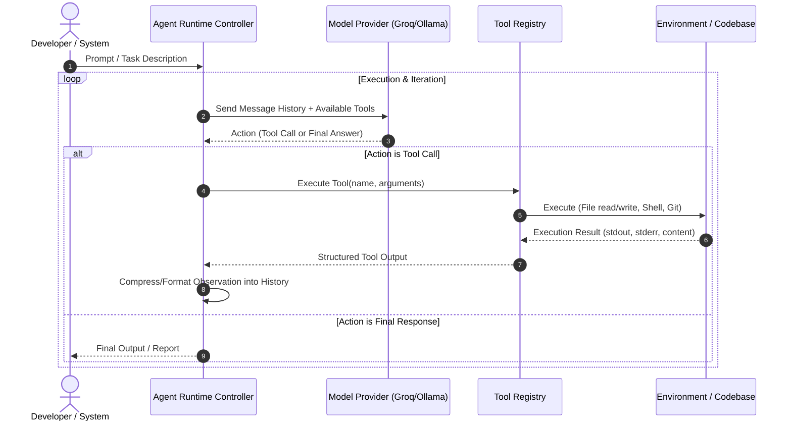

# Apricot Neo: Agent Runtime

## 1. Current Implementation Status

> [!NOTE]
> **Current Status: PHASE 1 COMPLETE (Phase 1.1, 1.2 & 1.3 Complete)**  
> The core provider abstraction ([`src/apricot/models/`](../src/apricot/models/)), tool registry & contracts ([`src/apricot/tools/`](../src/apricot/tools/)), and ReAct agent loop with execution audit state ([`src/apricot/agent/`](../src/apricot/agent/)) are implemented and tested.

The agent runtime features:
* **Universal Provider Interface:** Abstract `BaseProvider` with `GroqProvider` supporting function calling and structured messages.
* **Tool Abstraction:** `BaseTool`, `FunctionTool`, and `ToolRegistry` with duplicate protection, JSON schema generation, and safe execution dispatch.
* **ReAct Agent Loop:** `Agent` executes multi-step model → tool → model interactions with max-iteration guards, error resilience, and durable state tracking via `AgentState`.

---

## 2. Intended Phase 1 Agent Runtime Design

As specified in the Apricot 2.0 master plan ([`docs/neo-aprct-context.md`](neo-aprct-context.md)), the Phase 1 deliverable is a functional, testable local agent runtime.

### 2.1 Core Agent Loop (ReAct Style)

### 2.2 Core Components for Phase 1

1. **LLM Provider Abstraction (`BaseProvider`):**
   * Uniform interface for chat completions and function calling / tool use.
   * Initial provider: `GroqProvider` (fast cloud inference via `groq` SDK) with extensibility for `OllamaProvider` (local models).
   * Standardized message schema (`Role.SYSTEM`, `Role.USER`, `Role.ASSISTANT`, `Role.TOOL`).

2. **Tool Registry & Execution Subsystem:**
   * Strict parameter validation and schema generation.
   * Standardized tool categories:
     * **Repository Tools:** `list_files`, `read_file`, `search_text`, `search_code`, scoped strictly to an explicit repository root with traversal protection and exclusions.
     * **Git Tools:** `git_status`, `git_diff`, `git_log`, `git_show`, using captured no-shell subprocesses.
     * **Execution Tools:** `run_command`, `run_tests` (with timeout and output truncation guards).

3. **Context Budgeting & Management:**
   * Truncate large tool outputs (e.g. limit command output / diff lines).
   * Maintain token budgeting to prevent context explosion and reduce inference costs.

4. **Safety & Permission Controls:**
   * Execution boundaries (command allowlisting/denylisting).
   * Safe file path resolution within target repository root (prevent directory traversal).
