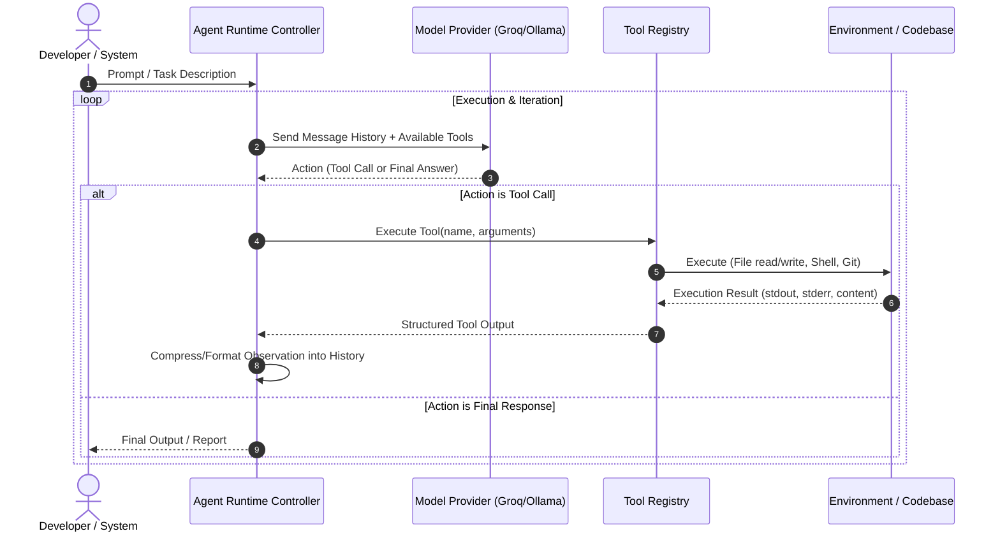

# Apricot Neo: Agent Runtime

## 1. Current Implementation Status

> [!WARNING]
> **Current Status: NOT YET IMPLEMENTED**  
> There is currently **no active agent runtime, prompt engine, or LLM execution loop** in the repository.

The repository currently only defines dependencies associated with an LLM agent ([`groq`](file:///C:/Users/hp/Desktop/PAPERS/neuropole/apricot-neo/requirements.txt#L9), [`click`](file:///C:/Users/hp/Desktop/PAPERS/neuropole/apricot-neo/requirements.txt#L4), [`rich`](file:///C:/Users/hp/Desktop/PAPERS/neuropole/apricot-neo/requirements.txt#L5), [`python-dotenv`](file:///C:/Users/hp/Desktop/PAPERS/neuropole/apricot-neo/requirements.txt#L3)), but contains zero Python source code.

---

## 2. Intended Phase 1 Agent Runtime Design

As specified in the Apricot 2.0 master plan ([`docs/neo-aprct-context.md`](file:///C:/Users/hp/Desktop/PAPERS/neuropole/apricot-neo/docs/neo-aprct-context.md)), the Phase 1 deliverable is a functional, testable local agent runtime.

### 2.1 Core Agent Loop (ReAct Style)

### 2.2 Core Components for Phase 1

1. **LLM Provider Abstraction (`BaseProvider`):**
   * Uniform interface for chat completions and function calling / tool use.
   * Initial provider: `GroqProvider` (fast cloud inference via `groq` SDK) with extensibility for `OllamaProvider` (local models).
   * Standardized message schema (`Role.SYSTEM`, `Role.USER`, `Role.ASSISTANT`, `Role.TOOL`).

2. **Tool Registry & Execution Subsystem:**
   * Strict parameter validation and schema generation.
   * Standardized tool categories:
     * **Filesystem Tools:** `read_file`, `write_file`, `list_directory`, `file_search`.
     * **Git Tools:** `git_status`, `git_diff`, `git_log`, `git_blame`.
     * **Execution Tools:** `run_command`, `run_tests` (with timeout and output truncation guards).

3. **Context Budgeting & Management:**
   * Truncate large tool outputs (e.g. limit command output / diff lines).
   * Maintain token budgeting to prevent context explosion and reduce inference costs.

4. **Safety & Permission Controls:**
   * Execution boundaries (command allowlisting/denylisting).
   * Safe file path resolution within target repository root (prevent directory traversal).
