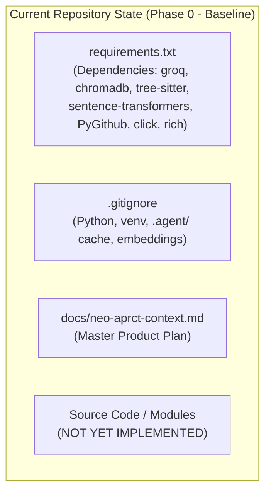
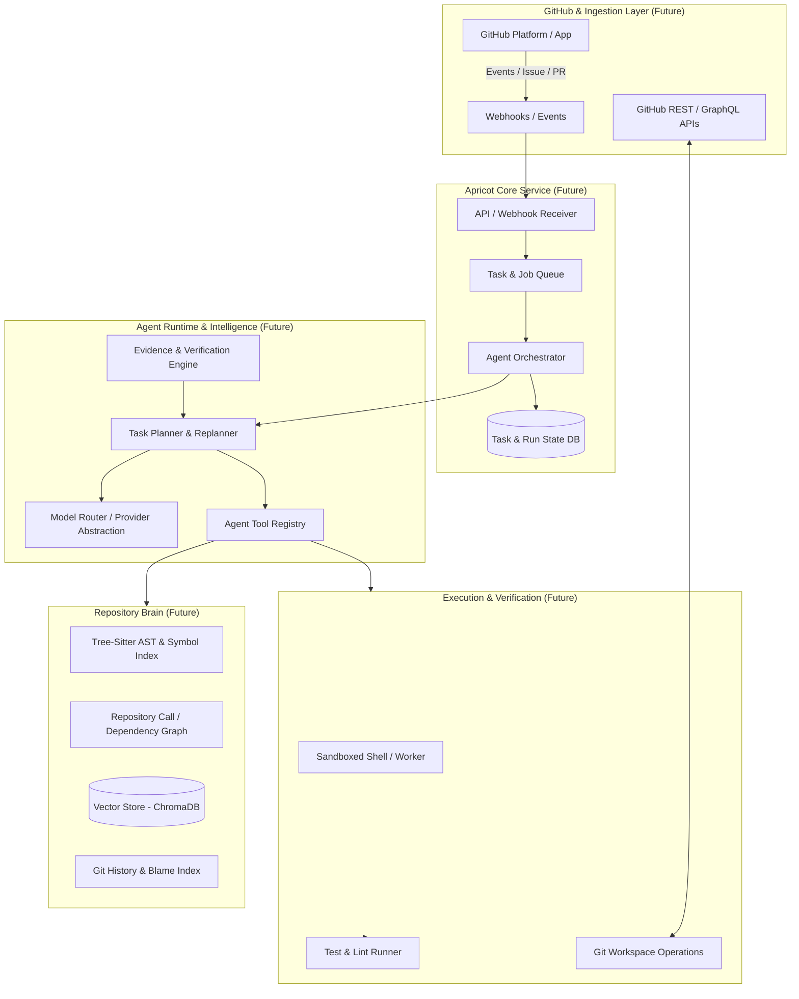

# Apricot Neo: Architecture Documentation

## 1. Executive Overview & Current State Baseline

Apricot Neo is currently in its **Phase 0 (Greenfield / Repository Inception)** state. 
There is currently **no executable application code or runtime logic** implemented in the repository. The codebase contains dependency manifests ([`requirements.txt`](file:///C:/Users/hp/Desktop/PAPERS/neuropole/apricot-neo/requirements.txt)), git ignore specifications ([`.gitignore`](file:///C:/Users/hp/Desktop/PAPERS/neuropole/apricot-neo/.gitignore)), an initial license ([`LICENSE`](file:///C:/Users/hp/Desktop/PAPERS/neuropole/apricot-neo/LICENSE)), a basic project description ([`README.md`](file:///C:/Users/hp/Desktop/PAPERS/neuropole/apricot-neo/README.md)), and the master vision document ([`docs/neo-aprct-context.md`](file:///C:/Users/hp/Desktop/PAPERS/neuropole/apricot-neo/docs/neo-aprct-context.md)).

---

## 2. Inferred Technology Foundations (From Manifests)

Based on the actual files present:
* **Runtime Language:** Python (evidenced by [`requirements.txt`](file:///C:/Users/hp/Desktop/PAPERS/neuropole/apricot-neo/requirements.txt) and [`.gitignore`](file:///C:/Users/hp/Desktop/PAPERS/neuropole/apricot-neo/.gitignore)).
* **LLM Provider Dependency:** [`groq`](file:///C:/Users/hp/Desktop/PAPERS/neuropole/apricot-neo/requirements.txt#L9).
* **Retrieval & Parsing Dependencies:** 
  * [`chromadb`](file:///C:/Users/hp/Desktop/PAPERS/neuropole/apricot-neo/requirements.txt#L6) (Vector store)
  * [`sentence-transformers`](file:///C:/Users/hp/Desktop/PAPERS/neuropole/apricot-neo/requirements.txt#L8) (Embedding models)
  * [`tree-sitter`](file:///C:/Users/hp/Desktop/PAPERS/neuropole/apricot-neo/requirements.txt#L7) (AST & code parsing)
* **GitHub Integration:** [`PyGithub`](file:///C:/Users/hp/Desktop/PAPERS/neuropole/apricot-neo/requirements.txt#L2), [`requests`](file:///C:/Users/hp/Desktop/PAPERS/neuropole/apricot-neo/requirements.txt#L1).
* **CLI & Output Layer:** [`click`](file:///C:/Users/hp/Desktop/PAPERS/neuropole/apricot-neo/requirements.txt#L4), [`rich`](file:///C:/Users/hp/Desktop/PAPERS/neuropole/apricot-neo/requirements.txt#L5).
* **Configuration:** [`python-dotenv`](file:///C:/Users/hp/Desktop/PAPERS/neuropole/apricot-neo/requirements.txt#L3).

---

## 3. Target Architecture (From Master Plan: Apricot 2.0)

> [!NOTE]
> All components described in this section are **FUTURE/TARGET** components derived from [`docs/neo-aprct-context.md`](file:///C:/Users/hp/Desktop/PAPERS/neuropole/apricot-neo/docs/neo-aprct-context.md). None of these components are implemented in the repository today.

The end state of Apricot Neo is a repository-native autonomous GitHub software engineer.

### 3.1 Target Component Architecture

### 3.2 Target Subsystems Breakdown

1. **Repository Brain (Planned):**
   * Multi-layered codebase intelligence: file, symbol, relation (imports/calls/implements), semantic embeddings, git history, and test mappings.
   * Utilizes Tree-sitter for concrete syntax trees and symbol extraction, combined with ChromaDB for vector retrieval.

2. **Agent Runtime (Planned - Phase 1 Focus):**
   * Core ReAct/tool-calling iteration loop.
   * Standardized tool interfaces: File read/write, terminal/shell execution, git inspection/operations.
   * Strict context budgeting and output compression.

3. **Planner & Specialized Investigators (Planned):**
   * Dynamic planning: formulate hypotheses, select relevant tools/subsystems, verify facts before taking destructive actions.
   * Specialized investigator subagents (Bug, Regression, Security, Architecture, Test, Review).

4. **Model Strategy & Routing (Planned):**
   * Provider-agnostic abstraction (`groq`, `ollama`, `openai`, `anthropic`).
   * Tiered routing: Fast/cheap/local models for repetitive tasks, high-capacity models for complex reasoning.

5. **Verification & Evidence Engine (Planned):**
   * Findings and PR changes must be backed by verifiable facts (reproducing tests, AST call traces, git commit blame).

6. **GitHub Native App & Web Platform (Planned - Later Phases):**
   * Transition from static CI actions to a hosted bot persona with a web dashboard for run inspection, state tracking, and permission management.
